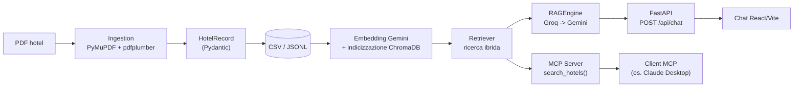

# HotelAI

Assistente concierge alberghiero basato su RAG: trasforma un catalogo hotel in PDF in dati strutturati interrogabili in linguaggio naturale, con estrazione assistita da LLM, ricerca ibrida su ChromaDB e un server MCP.

```text
PDF -> estrazione strutturata -> CSV/JSONL -> embedding + ChromaDB -> ricerca ibrida -> risposta RAG con citazioni di pagina
```

Esposto sia come chat web (FastAPI + React) sia come tool MCP per client compatibili (es. Claude Desktop).

## Cosa include

- **Pipeline PDF -> dati strutturati**: doppio parser (PyMuPDF per intestazioni font-size-aware, pdfplumber per segmentazione e bounding box) con `HotelRecord` (Pydantic) come schema canonico e tracciabilità per pagina di ogni campo.
- **Revisione qualità assistita da LLM**: i campi a bassa confidence vengono rivisti da Groq (default), con fallback automatico su Gemini; senza nessuna API key la pipeline resta comunque deterministica e verificabile offline.
- **Ricerca ibrida**: embedding Gemini su ChromaDB + rerank lessicale sui metadati strutturati.
- **RAG conversazionale**: `RAGEngine` sintetizza risposte in linguaggio naturale con citazioni di pagina per hotel (`POST /api/chat`).
- **Server MCP**: lo stesso motore di ricerca esposto come tool (`search_hotels`) per qualsiasi client MCP-compatibile.
- **Web app**: backend FastAPI + frontend React/Vite (tema scuro), con upload PDF live e re-indicizzazione a caldo.
- **39 test**, 100% mockati (nessuna chiamata API nella suite standard) più una modalità offline verificabile senza chiavi.

## Stack tecnico

Python 3.11 · FastAPI · Pydantic v2 · ChromaDB · PyMuPDF · pdfplumber · FastMCP · Groq / Google Gemini · React 19 · Vite.
Deploy: Render (backend) + Netlify (frontend). Piano free: il backend si sospende dopo inattività, la prima richiesta successiva può impiegare fino a ~50s per rispondere.

## Architettura



L'indicizzazione rilegge il CSV appena scritto invece di riusare i record ancora in memoria: è il collegamento esplicito tra estrazione e ricerca. Ogni documento vettoriale include i metadata strutturati del record (esclusi `source`/`quality`, solo per audit); i risultati sono ordinati con un punteggio ibrido vettoriale + overlap lessicale (`vector_weight`/`metadata_weight` in `.env`).

Flussi dettagliati, con i due inneschi (batch offline e upload live): [`user-doc/architecture-flow.md`](user-doc/architecture-flow.md) · [`user-doc/ingestion-flow.md`](user-doc/ingestion-flow.md).

## Quick start

### 1. Setup

```powershell
python -m venv .venv
.\.venv\Scripts\Activate.ps1
pip install -r requirements.txt
Copy-Item .env.example .env
```

### 2. Verifica offline (nessuna API key, nessuna chiamata esterna)

```powershell
$env:PYTHONPATH = "src"
python scripts/run_pipeline.py "data\raw\FileHotels.pdf" --offline
pytest -q
```

Con il PDF fornito: 19 blocchi rilevati, 19 record strutturati, zero chiamate Groq/Gemini. La modalità offline produce solo CSV/JSONL: non costruisce l'indice Chroma, che richiede un provider embedding configurato.

### 3. Pipeline completa (LLM ed embedding reali)

Impostare `GOOGLE_API_KEY` e/o `GROQ_API_KEY` in `.env`, poi:

```powershell
$env:PYTHONPATH = "src"
python scripts/run_pipeline.py "data\raw\FileHotels.pdf"
```

### 4. Web app (chat)

```powershell
$env:PYTHONPATH = "src"
python -m uvicorn api.main:app --reload --reload-dir src --port 8000
# --reload-dir src limita il watcher al codice sorgente: senza, il salvataggio
# dei file generati da /api/ingest sotto data/ farebbe riavviare il server a metà richiesta.
```

```powershell
cd frontend
npm install
npm run dev
```

Il frontend gira su `http://localhost:5173` e proxya `/api/*` verso il backend su `http://localhost:8000` (`vite.config.js`); il backend ha anche CORS aperto verso `localhost:5173` come seconda difesa. Su Windows, doppio click su [`start.bat`](start.bat) avvia backend e frontend insieme.

Endpoint: `POST /api/chat` (risposta RAG), `GET /api/hotels` (catalogo canonico da `data/processed/hotels_data.jsonl`), `POST /api/ingest` (upload PDF dalla sidebar: rigenera CSV/indice e ricarica il retriever a caldo), `GET /api/health` (connettività Chroma + presenza chiavi Groq/Gemini). Le risposte dell'assistente sono renderizzate come Markdown (`react-markdown` + `remark-gfm`, nomi hotel in grassetto, elenchi); le citazioni di pagina `[Pag. x-y]` vengono invece mostrate come badge separati e rimosse dal testo.

### 5. Server MCP

```powershell
$env:PYTHONPATH = "src"
python -m mcp_server.server
```

Espone il tool `search_hotels(query: str) -> str`, al massimo cinque risultati Markdown. Configurazione per client desktop MCP (o MCP Inspector):

```json
{
  "mcpServers": {
    "hotelai": {
      "command": "<path assoluto a .venv\\Scripts\\python.exe>",
      "args": ["-m", "mcp_server.server"],
      "cwd": "<path assoluto alla cartella del repository>",
      "env": {"PYTHONPATH": "src"}
    }
  }
}
```

`command` deve puntare all'eseguibile Python del `.venv` del progetto, non a un `python` generico: molti client desktop (es. Claude Desktop su Windows) lanciano il processo senza ereditare il PATH di una shell con l'ambiente virtuale attivato, quindi un `"command": "python"` può risolvere un interprete di sistema privo delle dipendenze (`fastmcp`, `chromadb`, ...) e far fallire silenziosamente la connessione.

## Query di esempio

- Cerco una struttura pet-friendly vicino al mare.
- Mostrami soluzioni con pensione completa e piscina.
- Quali strutture sono più adatte a una famiglia con bambini?
- Cerco una struttura con spa o centro benessere.
- Trova strutture con camere family e parcheggio.

## Provider LLM, quote e fallback

Groq (`openai/gpt-oss-120b`) è il provider di default per la revisione dei record a bassa confidence e per le risposte RAG, con fallback automatico su Gemini (`gemini-flash-latest`) quando Groq non è configurato o esaurisce i retry. Senza nessuna delle due chiavi l'estrazione resta deterministica (fallback locale) e le risposte RAG restituiscono un messaggio di fallback fisso, senza errori. Gli embedding usano solo Gemini (`gemini-embedding-001`); senza `GOOGLE_API_KEY` l'indicizzazione usa un embedder offline deterministico, non semanticamente equivalente. Modelli, rate limit e retry (`GOOGLE_MODEL`, `GROQ_MODEL`, `EMBEDDING_MODEL`, `REQUEST_DELAY_SECONDS`, `GEMINI_REQUESTS_PER_MINUTE`, `GROQ_REQUESTS_PER_MINUTE`, `MAX_RETRIES`) sono configurabili in `.env`; gli errori Google 404/429/5xx sono espliciti, con retry e backoff su 429 e 5xx.

Il raggruppamento in schede individua le intestazioni nel testo PDF e associa la pagina seguente; se un catalogo non conserva le intestazioni attese, scatta il fallback strutturale "introduzione + coppie di pagine". I nomi hotel non sono mantenuti in liste hardcoded: sono estratti dall'intestazione e normalizzati solo per correggere artefatti OCR evidenti.

## Dati estratti e qualità

Il JSONL è lo storage canonico auditabile; il CSV è l'interfaccia tra estrazione e indicizzazione. Ogni record può contenere categoria numerica, valutazioni strutturate (`ente`, `tipo`, `punteggio/massimo`), qualificatori, testo originale, pagine sorgente e una confidence per campo; i punteggi non leggibili restano `null` invece di essere indovinati. L'estrazione deterministica (PyMuPDF per nome/località, euristiche testuali/regex per gli altri campi) è il primo passo; Groq testuale (fallback Gemini) rivede i record a bassa confidence, e Gemini Vision legge le valutazioni visuali quando il testo non le riporta come punteggi numerici.

## Verifica

```powershell
$env:PYTHONPATH = "src"
pytest -q
```

Il PDF fornito produce 19 righe CSV; `source_pages` rende ogni campo tracciabile fino alle pagine originali. Limiti noti: l'ordine del testo estratto dal PDF e alcuni artefatti OCR possono richiedere una revisione visiva; il fallback deterministico è conservativo e non sostituisce la validazione semantica del modello.

## Licenza

[MIT](LICENSE)
