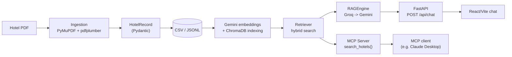

# HotelAI

[](https://github.com/workfromrome/HotelAI/actions/workflows/ci.yml)
[](LICENSE)


RAG-based hotel concierge assistant: turns a hotel catalogue PDF into structured, natural-language-searchable data, with LLM-assisted extraction, hybrid search on ChromaDB, and an MCP server.

```text
PDF -> structured extraction -> CSV/JSONL -> embeddings + ChromaDB -> hybrid search -> RAG answer with page citations
```

Exposed both as a web chat (FastAPI + React) and as an MCP tool for compatible clients (e.g. Claude Desktop).

## Live demo

- **Backend API**: https://hotelai-backend-qjwr.onrender.com — try [`/api/health`](https://hotelai-backend-qjwr.onrender.com/api/health)
- **Frontend**: https://heartfelt-macaron-723b76.netlify.app/

Runs on Render's and Netlify's free tiers: the backend spins down after inactivity, so the first request after a while can take up to ~50s to respond.

## What it includes

- **PDF -> structured data pipeline**: dual parser (PyMuPDF for font-size-aware headers, pdfplumber for segmentation and bounding boxes) with `HotelRecord` (Pydantic) as the canonical schema and per-page traceability for every field.
- **LLM-assisted quality review**: low-confidence fields are reviewed by Groq (default), with automatic fallback to Gemini; without any API key the pipeline stays fully deterministic and verifiable offline.
- **Hybrid search**: Gemini embeddings on ChromaDB + lexical rerank on structured metadata.
- **Conversational RAG**: `RAGEngine` synthesizes natural-language answers with per-hotel page citations (`POST /api/chat`).
- **MCP server**: the same search engine exposed as a tool (`search_hotels`) for any MCP-compatible client.
- **Web app**: FastAPI backend + React/Vite frontend (dark theme), with live PDF upload and hot re-indexing.
- **39 tests**, fully mocked (no API calls in the standard suite), plus an offline mode verifiable without any keys.

## Tech stack

Python 3.11 · FastAPI · Pydantic v2 · ChromaDB · PyMuPDF · pdfplumber · FastMCP · Groq / Google Gemini · React 19 · Vite.
Deploy: Render (backend) + Netlify (frontend).

## Architecture



Indexing re-reads the CSV that was just written instead of reusing the records still held in memory: this is the explicit seam between extraction and search. Every vector document includes the record's structured metadata (excluding `source`/`quality`, kept for audit only); results are ranked with a hybrid vector + lexical-overlap score (`vector_weight`/`metadata_weight` in `.env`).

Detailed flow docs, covering both triggers (offline batch and live upload) — currently in Italian: [`user-doc/architecture-flow.md`](user-doc/architecture-flow.md) · [`user-doc/ingestion-flow.md`](user-doc/ingestion-flow.md).

## Quick start

### 1. Setup

```powershell
python -m venv .venv
.\.venv\Scripts\Activate.ps1
pip install -r requirements.txt
Copy-Item .env.example .env
```

### 2. Offline verification (no API key, no external calls)

```powershell
$env:PYTHONPATH = "src"
python scripts/run_pipeline.py "data\raw\FileHotels.pdf" --offline
pytest -q
```

With the sample PDF: 19 blocks detected, 19 structured records, zero Groq/Gemini calls. Offline mode only produces CSV/JSONL: it doesn't build the Chroma index, which requires a configured embedding provider.

### 3. Full pipeline (real LLM and embeddings)

Set `GOOGLE_API_KEY` and/or `GROQ_API_KEY` in `.env`, then:

```powershell
$env:PYTHONPATH = "src"
python scripts/run_pipeline.py "data\raw\FileHotels.pdf"
```

### 4. Web app (chat)

```powershell
$env:PYTHONPATH = "src"
python -m uvicorn api.main:app --reload --reload-dir src --port 8000
# --reload-dir src limits the watcher to source code: without it, files written
# by /api/ingest under data/ would restart the server mid-request.
```

```powershell
cd frontend
npm install
npm run dev
```

The frontend runs on `http://localhost:5173` and proxies `/api/*` to the backend on `http://localhost:8000` (`vite.config.js`); the backend also keeps CORS open to `localhost:5173` as a second line of defense. On Windows, double-click [`start.bat`](start.bat) to launch backend and frontend together.

Endpoints: `POST /api/chat` (RAG answer), `GET /api/hotels` (canonical catalogue from `data/processed/hotels_data.jsonl`), `POST /api/ingest` (PDF upload from the sidebar: regenerates the CSV/index and hot-reloads the retriever), `GET /api/health` (Chroma connectivity + Groq/Gemini key presence). Assistant replies are rendered as Markdown (`react-markdown` + `remark-gfm`, hotel names in bold, lists); page citations `[p. x-y]` are shown as separate badges and stripped out of the text.

### 5. MCP server

```powershell
$env:PYTHONPATH = "src"
python -m mcp_server.server
```

Exposes the `search_hotels(query: str) -> str` tool, at most five Markdown results. Config for a desktop MCP client (or MCP Inspector):

```json
{
  "mcpServers": {
    "hotelai": {
      "command": "<absolute path to .venv\\Scripts\\python.exe>",
      "args": ["-m", "mcp_server.server"],
      "cwd": "<absolute path to the repository folder>",
      "env": {"PYTHONPATH": "src"}
    }
  }
}
```

`command` must point at the project's own `.venv` Python executable, not a generic `python`: many desktop clients (e.g. Claude Desktop on Windows) launch the process without inheriting a shell's activated-venv PATH, so `"command": "python"` can resolve to a system interpreter missing the project's dependencies (`fastmcp`, `chromadb`, ...) and silently fail the connection.

## Example queries

- Looking for a pet-friendly place near the sea.
- Show me options with full board and a pool.
- Which places suit a family with children best?
- Looking for a place with a spa or wellness center.
- Find places with family rooms and parking.

## LLM providers, quotas and fallback

Groq (`openai/gpt-oss-120b`) is the default provider for reviewing low-confidence records and for RAG answers, with automatic fallback to Gemini (`gemini-flash-latest`) when Groq isn't configured or exhausts its retries. Without either key, extraction stays deterministic (local fallback) and RAG answers return a fixed fallback message, with no errors. Embeddings only use Gemini (`gemini-embedding-001`); without `GOOGLE_API_KEY`, indexing falls back to a deterministic offline embedder that is not semantically equivalent. Models, rate limits and retries (`GOOGLE_MODEL`, `GROQ_MODEL`, `EMBEDDING_MODEL`, `REQUEST_DELAY_SECONDS`, `GEMINI_REQUESTS_PER_MINUTE`, `GROQ_REQUESTS_PER_MINUTE`, `MAX_RETRIES`) are configurable in `.env`; Google 404/429/5xx errors are surfaced explicitly, with retry and backoff on 429 and 5xx.

Card grouping detects headers in the PDF text and associates the following page with them; if a catalogue doesn't preserve the expected headers, a structural "intro + page pairs" fallback kicks in. Hotel names aren't kept in hardcoded lists: they're extracted from the header and normalized only to fix obvious OCR artifacts.

## Extracted data and quality

The JSONL file is the canonical, auditable store; the CSV is the interface between extraction and indexing. Each record can carry a numeric category, structured ratings (`body`, `type`, `score/max`), qualifiers, original text, source pages and a per-field confidence; unreadable scores stay `null` instead of being guessed. Deterministic extraction (PyMuPDF for name/locality, text heuristics/regex for the rest) runs first; text-based Groq (Gemini fallback) reviews low-confidence records, and Gemini Vision reads visual ratings when the text doesn't report them as numeric scores.

## Testing

```powershell
$env:PYTHONPATH = "src"
pytest -q
```

The sample PDF produces 19 CSV rows; `source_pages` makes every field traceable back to its original pages. Known limits: PDF text extraction order and some OCR artifacts may need visual review; the deterministic fallback is conservative and doesn't replace the model's semantic validation.

## RAG retrieval eval

`pytest` covers plumbing and the deterministic criteria-reranking logic, but the offline embedder it uses for that is hash-based, not semantic — it can't tell you whether a natural-language query actually finds the right hotel. [`scripts/eval_rag.py`](scripts/eval_rag.py) does: it runs a small hand-verified set of queries ([`scripts/eval_queries.json`](scripts/eval_queries.json), 12 cases) against the real committed index with real Gemini embeddings, and reports Recall@5.

```powershell
$env:PYTHONPATH = "src"
python scripts/eval_rag.py
```

Needs `GOOGLE_API_KEY` and spends real embedding quota, so it's not part of the automated test suite — run it manually when retrieval logic changes. Currently 12/12.

## License

[MIT](LICENSE)
