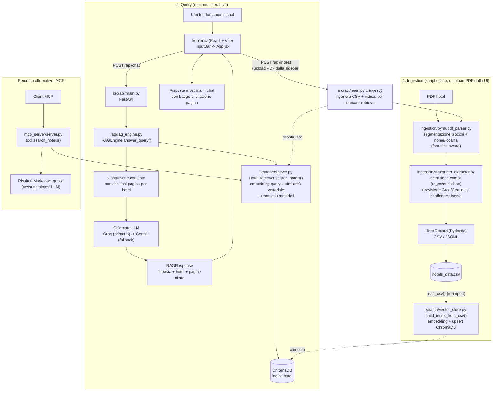

# Flusso ad alto livello — HotelAI

Questo documento descrive, ad alto livello, come l'app trasforma i PDF degli hotel in un catalogo interrogabile in linguaggio naturale, e come una domanda dell'utente diventa una risposta.

## Panoramica dei componenti

| Componente | Percorso | Ruolo |
|---|---|---|
| Ingestion | `src/ingestion/` | Estrae testo dai PDF, rivede i record a bassa confidence (Groq/Gemini), produce record strutturati |
| Search | `src/search/` | Genera embedding e indicizza/recupera gli hotel su ChromaDB |
| RAG Engine | `src/rag/rag_engine.py` | Combina retrieval + LLM per rispondere alle domande |
| API | `src/api/main.py` | Espone il backend FastAPI al frontend: chat, catalogo hotel, health, e re-ingestione PDF live (`/api/ingest`) |
| Frontend | `frontend/` | SPA React/Vite in stile chat |
| MCP Server | `src/mcp_server/server.py` | Espone la ricerca hotel come tool MCP (percorso alternativo, senza sintesi LLM) |
| Config | `src/hotelai/config.py` | Chiavi API, modelli, pesi di ranking, percorsi |

## Flowchart

## Note sul flusso

- **Ingestion ha due inneschi**: quello tipico è offline, una tantum (o quando arrivano nuovi PDF), tramite `scripts/run_pipeline.py`; il secondo è live, dalla UI — il pulsante "Carica un PDF" nella sidebar chiama `POST /api/ingest`, che rigenera CSV e indice in modo sincrono e ricarica il retriever, così le risposte successive vedono subito i nuovi dati. Nessuno dei due gira ad ogni richiesta di chat.
- **L'indicizzazione importa davvero il CSV**: `build_index_from_csv` rilegge `hotels_data.csv` con `read_csv` invece di riusare i record ancora in memoria dall'estrazione.
- **Un chunk per hotel**: a differenza di molte pipeline RAG, non c'è suddivisione in sotto-chunk — l'intero blocco di testo di un hotel diventa un singolo documento indicizzato, con metadati associati (categoria, rating, ecc.) usati anche per il rerank lessicale.
- **Fallback LLM a due livelli**: sia in fase di revisione dei record a bassa confidence sia in fase di risposta, Groq è il provider primario e Gemini il fallback in caso di errore/indisponibilità. Nessuno dei due livelli è cachato oggi.
- **"Conversazionale" è il tono del prompt, non memoria multi-turno**: ogni domanda viene elaborata come una richiesta singola — non viene passata la cronologia della conversazione al motore RAG.
- **Due modi di interrogare i dati**: il frontend web passa sempre da `RAGEngine` (risposta sintetizzata in linguaggio naturale); il server MCP espone invece il retrieval grezzo (Markdown con i risultati), senza generazione LLM.
- **Frontend e backend in dev**: Vite (porta 5173) fa da proxy verso FastAPI (porta 8000) per le chiamate `/api/*`; il backend ha comunque CORS abilitato per 5173 come rete di sicurezza aggiuntiva.
