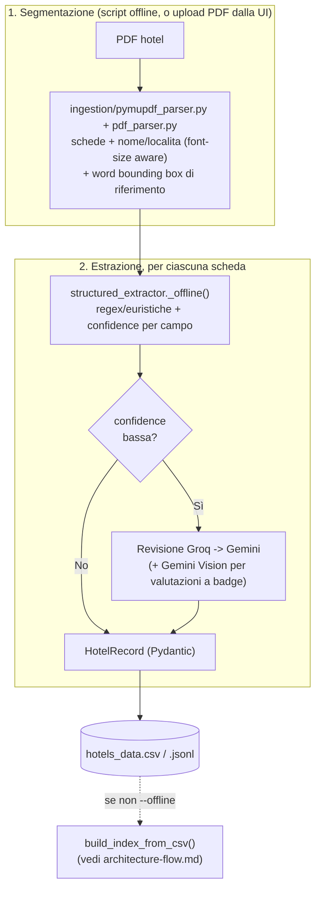

# Flusso di Ingestion — HotelAI

Dettaglio della fase 1 di [`architecture-flow.md`](architecture-flow.md): come un PDF di hotel diventa `HotelRecord` (Pydantic) su CSV/JSONL, prima dell'indicizzazione ChromaDB.

## Flowchart

## Note sul flusso

- **Due inneschi, stesso codice**: `scripts/run_pipeline.py` (batch/offline) e `POST /api/ingest` (upload dalla sidebar) chiamano entrambi `extract_catalogue`; nessuno dei due gira ad ogni chat.
- **Due parser complementari**: `pymupdf_parser.py` è la fonte canonica di `nome`/`localita`; `pdf_parser.py` (pdfplumber) fa OCR cleanup, fornisce le word bounding box per il fallback visuale sulle valutazioni, e resta il fallback strutturale se un catalogo non ha i marker attesi.
- **Un campo debole basta**: `quality.confidence` è il minimo tra le confidence dei singoli campi — una sola bassa manda l'intero record in revisione LLM (mai selettiva per campo).
- **Mai un'eccezione fino in fondo**: se Groq e Gemini falliscono entrambi, il record deterministico viene scritto comunque, taggato `review_llm_non_disponibile` invece di bloccare l'estrazione.
- **L'output è un file**: `write_csv`/`write_jsonl` chiudono la fase; l'indicizzazione rilegge il CSV da disco invece di riusare i record in memoria.
